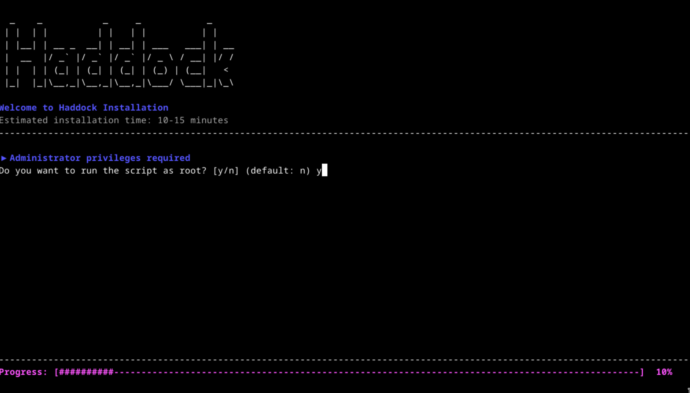
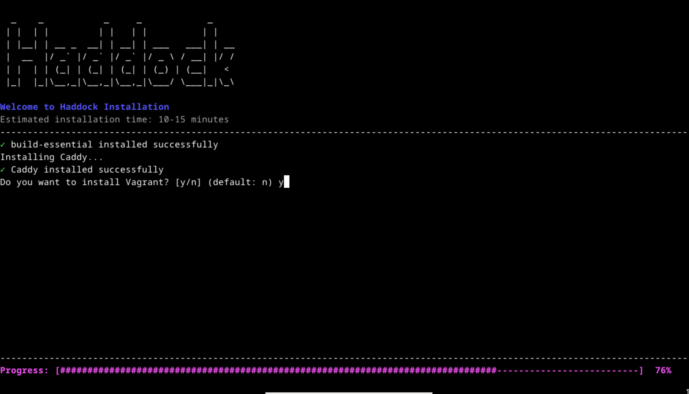
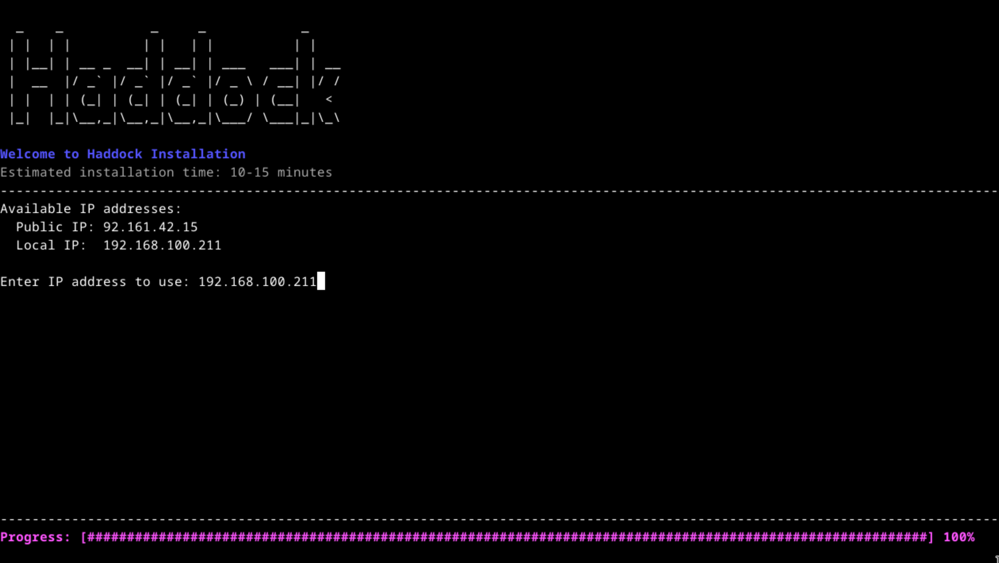
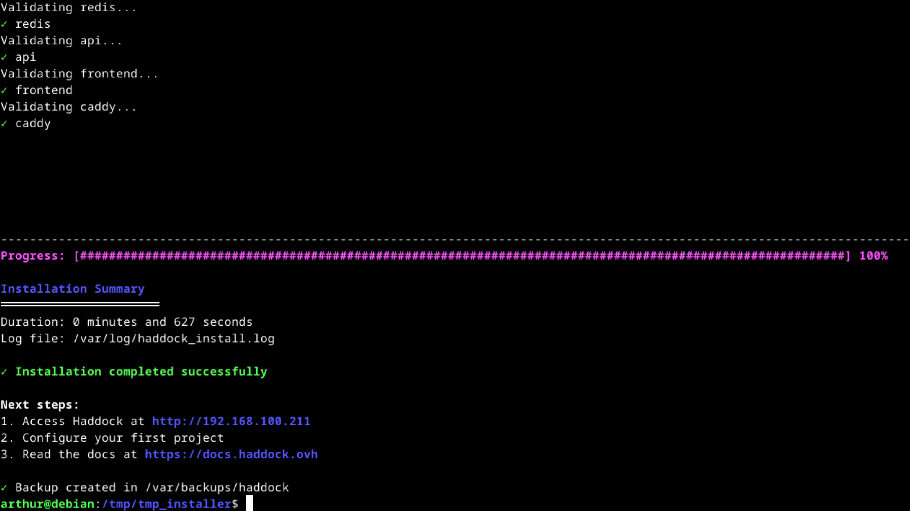

# Test de l'installeur

## Environnement de test

Machine virtuelle avec une simple installation de debian 12, sans configuration.

## Rôle de l'utilisateur

Lancer le script d'installation.

## Fonctionnalité testée

Script d'installation :
- installation des dépendances
- configuration des dépendances (ex: database, caddy,... )
- installation d'Haddock
- lancement d'Haddock

[Voir la description complète](../../beta_test_plan.md#installateur)

## Étape(s) du test

Lancer le scipt d'installation, suivre les étapes en accèptant l'installation des dépendances et rentrer les informations demandées par le scritp (ex: ip).

```shell
$> ls
install.sh scripts

$> ./install.sh
```

Accèpter l'exécution du script en tant que root :




Accèpter l'installation de [vagrant](https://developer.hashicorp.com/vagrant) :



Renter l'addresse ip de la machine hôte :




## Résultat(s) attendu(s)

Le script d'installation se termine avec succès, toutes les étapes on réussit (voir le récape à la fin du script).



## Résultat(s) obtenu(s)

